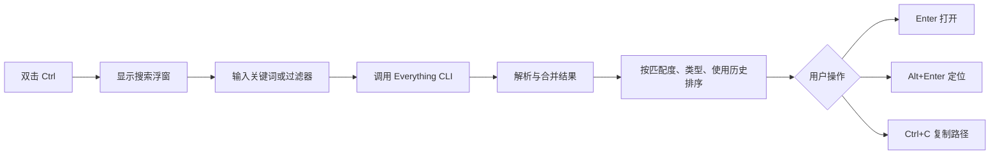
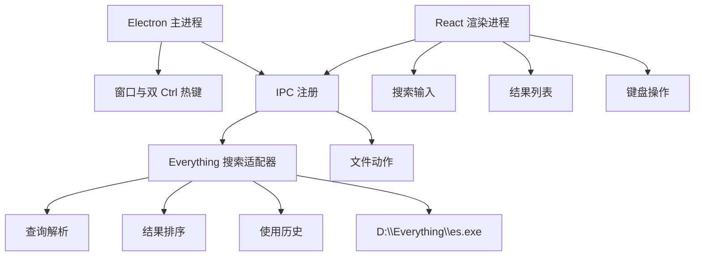
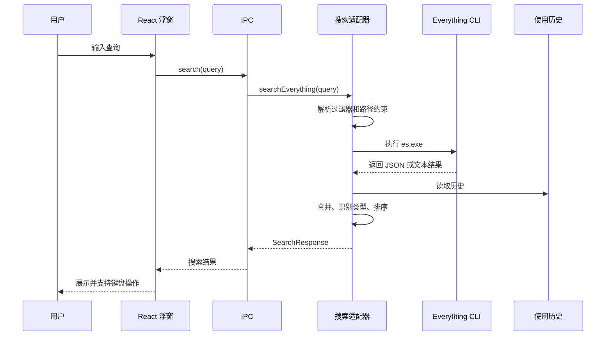

# Everything Quick Launcher

一个面向 Windows 的键盘优先快速启动器。它把本机 Everything 的搜索能力包装成轻量浮窗：双击 `Ctrl` 呼出，输入关键词，直接打开文件、定位目录或复制路径。

## 功能概览



- 使用 `D:\Everything\es.exe` 获取本机文件、文件夹和应用结果。
- 支持 `folder:`、`file:`、`doc:`、`pic:`、`video:`、`audio:` 类型过滤。
- 支持路径约束，例如 `desktop\毕业` 会把路径和关键词拆开搜索。
- 支持中文名称的拼音和首字母排序增强，例如 `weixin`、`wx` 可命中中文应用名。
- 记录成功打开过的路径，让常用结果在后续搜索中更靠前。
- Everything IPC 未运行时会尝试启动 `D:\Everything\Everything.exe` 后重试。

## 使用方式

启动应用后，它默认隐藏在后台。

| 操作 | 说明 |
| --- | --- |
| 双击 `Ctrl` | 呼出并聚焦搜索浮窗 |
| `Esc` | 隐藏浮窗 |
| `↑` / `↓` | 切换选中结果 |
| `Enter` | 打开选中结果 |
| `Alt+Enter` | 在资源管理器中定位选中结果 |
| `Ctrl+C` | 复制选中结果路径 |
| `Ctrl+1` 到 `Ctrl+8` | 直接打开当前可见的第 1 到第 8 个结果 |
| `Ctrl+9` | 展示更多结果 |

## 查询语法

| 示例 | 含义 |
| --- | --- |
| `qq` | 搜索名称或路径中包含 `qq` 的结果 |
| `folder: project` | 只搜索文件夹 |
| `file: report` | 只搜索文件 |
| `doc: 毕业` | 搜索文档类文件，如 `docx`、`pdf`、`md`、`xlsx`、`pptx` |
| `pic: logo` | 搜索图片类文件 |
| `video: demo` | 搜索视频类文件 |
| `audio: music` | 搜索音频类文件 |
| `D:\Work\ report` | 在路径约束下搜索关键词 |

## 运行环境

- Windows
- Node.js 和 npm
- Everything 已安装在 `D:\Everything`
- Everything CLI 可执行文件位于 `D:\Everything\es.exe`

> 当前代码中的 Everything 路径是固定值。如果你的 Everything 安装在其他目录，需要先调整 `src/main/everythingSearch.ts` 中的 `ES_PATH` 和 `EVERYTHING_PATH`。

## 开发

安装依赖：

```powershell
npm install
```

运行测试：

```powershell
npm test
```

构建渲染进程和主进程：

```powershell
npm run build
```

构建后启动 Electron：

```powershell
npm start
```

打包 Windows portable 版本：

```powershell
npm run dist
```

## 项目结构



| 路径 | 作用 |
| --- | --- |
| `src/main/main.ts` | 创建无边框浮窗、注册全局键盘钩子、控制窗口显示和聚焦 |
| `src/main/ipc.ts` | 暴露搜索、打开、定位、复制、隐藏窗口等 IPC 能力 |
| `src/main/everythingSearch.ts` | 调用 Everything CLI，解析输出，处理 IPC 未运行时的重试 |
| `src/main/searchQuery.ts` | 解析查询过滤器、路径约束和关键词，生成 Everything 参数 |
| `src/main/searchRanking.ts` | 根据文件名、路径、类型、拼音和使用历史计算排序 |
| `src/main/usageHistory.ts` | 读写打开历史，用于排序加权 |
| `src/renderer/App.tsx` | 搜索浮窗 UI、结果列表和快捷键交互 |
| `src/preload.cts` | 通过 `contextBridge` 暴露安全的渲染进程 API |
| `tests/` | Vitest 测试 |

## 搜索链路



## 测试重点

- 双击 `Ctrl` 的检测和窗口聚焦行为。
- Everything 输出解析、GB18030 解码、JSON attributes 类型判断。
- 查询过滤器、路径约束和扩展名过滤参数。
- 拼音候选召回、拼音排序、应用结果优先。
- 打开成功后的使用历史记录。
- Vite、Electron preload、窗口行为等配置。
