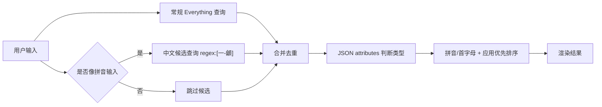

# 搜索策略 V1 实现计划

> **给 agentic workers：** 必须使用 `superpowers:executing-plans` 按任务执行。本计划使用 checkbox（`- [ ]`）追踪进度。

**目标：** 在现有 Everything 搜索适配器外增加一层 Listary 风格的 V1 搜索策略：查询解析、类型过滤器、路径约束、结果排序和使用记录加权。

**架构：** 保持 Everything 作为底层搜索引擎，不自建索引。新增纯函数模块负责把用户输入解析为搜索计划，新增排序模块对 Everything 结果打分，新增使用记录模块记录打开次数和最近打开时间，再由 `searchEverything` 串联这些能力。

**技术栈：** TypeScript、Vitest、Electron IPC、Everything CLI。

---

## 文件结构

- 新建 `src/main/searchQuery.ts`：解析 `folder:`、`file:`、`doc:`、`pic:`、`video:`、`audio:` 等过滤器，识别路径约束和普通关键词，生成 Everything CLI 参数。
- 新建 `src/main/searchRanking.ts`：根据文件名匹配、路径匹配、使用记录和降权目录计算排序分数。
- 新建 `src/main/usageHistory.ts`：读写 JSON 使用记录，记录打开次数和最近打开时间。
- 修改 `src/main/everythingSearch.ts`：使用查询解析、GB18030 解码、排序策略和更大的候选召回数量。
- 修改 `src/main/ipc.ts`：打开文件时记录使用历史。
- 修改 `tests/main/*`：增加查询解析、排序和使用历史测试。

## 任务 1：查询解析

- [x] 写失败测试：`folder: qq` 生成 `/ad`，`file: qq` 生成 `/a-d`，`doc: 毕业` 生成扩展名过滤，`desktop\毕业` 保留路径约束。
- [x] 实现 `src/main/searchQuery.ts`。
- [x] 运行 `npm test -- tests/main/searchQuery.test.ts`，确认通过。
- [x] 提交：`feat: add search query parser`

## 任务 2：排序策略

- [x] 写失败测试：文件名精确匹配高于前缀匹配，前缀匹配高于包含匹配，路径命中低于文件名命中。
- [x] 写失败测试：最近打开和打开次数高的结果加分，`node_modules`、回收站、临时目录结果降权。
- [x] 实现 `src/main/searchRanking.ts`。
- [x] 运行 `npm test -- tests/main/searchRanking.test.ts`，确认通过。
- [x] 提交：`feat: rank search results`

## 任务 3：使用记录

- [x] 写失败测试：打开文件后增加 `openCount`，更新 `lastOpenedAt`。
- [x] 写失败测试：历史文件不存在或 JSON 损坏时返回空历史。
- [x] 实现 `src/main/usageHistory.ts`。
- [x] 运行 `npm test -- tests/main/usageHistory.test.ts`，确认通过。
- [x] 提交：`feat: track usage history`

## 任务 4：接入 Everything 搜索

- [x] 写失败测试：`searchEverything("folder: qq")` 调用 `es.exe` 时包含 `/ad`，`searchEverything("doc: 毕业")` 包含文档扩展名过滤。
- [x] 写失败测试：返回结果会按 V1 分数排序。
- [x] 修改 `src/main/everythingSearch.ts`，使用 `buildEverythingArgs` 和 `rankSearchResults`。
- [x] 修复错误提示中文编码。
- [x] 运行 `npm test -- tests/main/everythingSearch.test.ts`，确认通过。
- [x] 提交：`feat: apply V1 search strategy`

## 任务 5：打开记录接入

- [x] 写失败测试：IPC 的 `open-path` 会在成功打开后记录使用历史。
- [x] 修改 `src/main/ipc.ts`。
- [x] 运行相关测试。
- [x] 提交：`feat: record opened search results`

## 任务 6：最终验证

- [x] 运行 `npm test`。
- [x] 运行 `npm run build`。
- [ ] 手动验证：
  - `folder: qq` 只出现文件夹。
  - `file: qq` 只出现文件。
  - `doc: 毕业` 优先出现文档。
  - `desktop\毕业` 能缩小路径范围。
  - 打开过的结果再次搜索排名上升。

## 自检

- V1 不包含拼音/首字母搜索。
- V1 不包含预览窗口或动作菜单。
- V1 不改变当前 UI 布局。
- 所有新增行为必须有测试覆盖。

---

## V1.1：基于 Everything 官方能力的搜索修正

**背景：** Everything 本体不是完整开源项目，但官方 ES CLI 与 SDK 文档说明了可复用能力：结构化 JSON 输出、属性返回、Everything 搜索语法和正则查询。V1.1 继续使用 ES CLI，不自建文件索引。

### 已执行

- [x] ES 查询统一增加 `-json -attributes`，用属性位判断目录，避免“无扩展名文件”被误判为文件夹。
- [x] 文件夹结果不再逐路径调用 `app.getFileIcon()`，前端固定渲染文件夹图标。
- [x] 双击 Ctrl 改为强制显示并聚焦：已显示时不再隐藏，隐藏交给 Esc、失焦和打开结果。
- [x] 增加拼音候选召回：英文拼音样式输入会追加一次 `regex:[一-龥]` 中文候选查询。
- [x] 增加本地拼音排序：`weixin -> 微信`、`wx -> 微信` 可按全拼和首字母命中。
- [x] 补充测试覆盖 JSON 属性解析、文件夹图标策略、拼音候选召回、拼音排序、Ctrl 聚焦。
- [x] 运行 `npm test`：68 个测试通过。
- [x] 运行 `npm run build`：构建通过。

### 后续候选

- [ ] 为拼音候选增加本地缓存，减少短时间重复查询中文候选池。
- [ ] 将中文候选限制进一步按应用目录、桌面、常用目录分层召回。
- [ ] 对多音字和混合中英文名称加入更细的打分规则。
