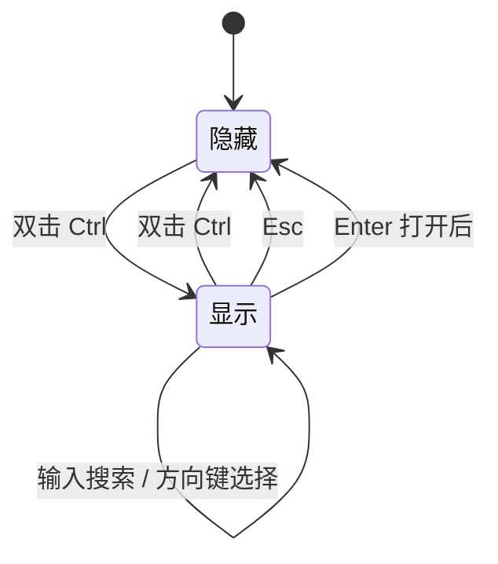
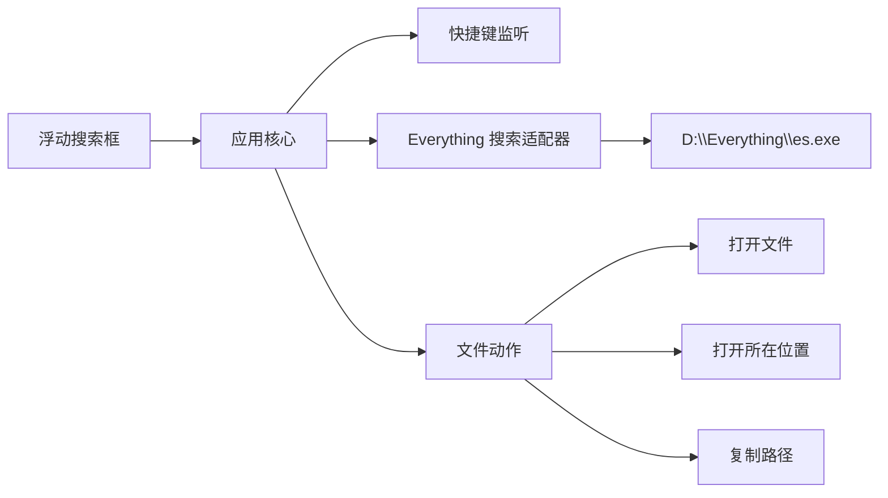
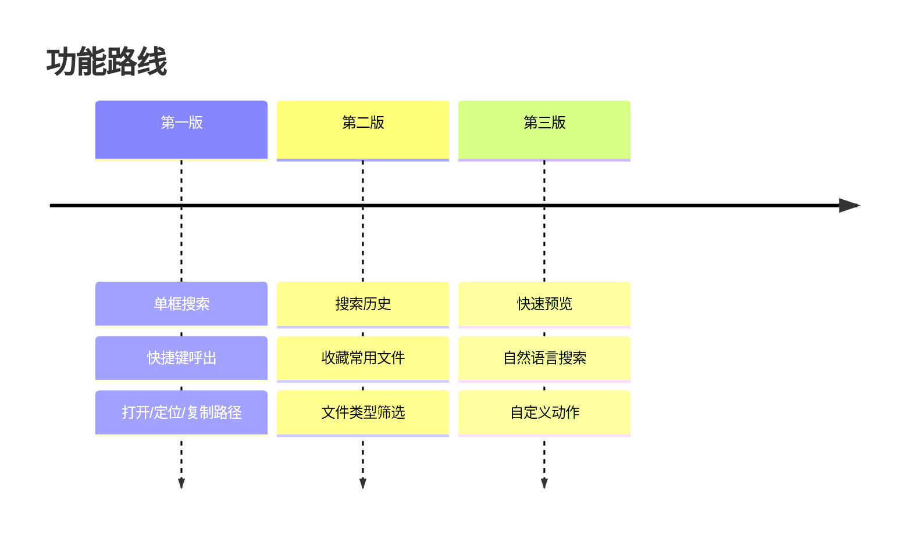

# Everything 快速启动器设计

## 目标

开发一款 Windows 桌面应用，提供一个轻量的浮动搜索框。用户通过双击 Ctrl 呼出或隐藏窗口，输入关键词后直接调用本机 Everything 的搜索能力，快速打开文件、定位文件或复制路径。

第一版不重建索引，不做复杂主窗口，重点是把 Everything 的能力变成一个更顺手的键盘入口。

## 范围

### 第一版包含

- 居中浮动单框界面。
- 双击 Ctrl 呼出或隐藏搜索框。
- Esc 在搜索框显示时隐藏窗口。
- 输入关键词实时搜索。
- 通过 `D:\Everything\es.exe` 获取搜索结果。
- 结果列表展示文件名和完整路径。
- 键盘操作：
  - 上下方向键切换选中结果。
  - Enter 打开选中文件。
  - Alt+Enter 打开选中文件所在位置。
  - Ctrl+C 复制选中结果路径。

### 第一版不包含

- 自建文件索引。
- AI 或自然语言语义搜索。
- 复杂筛选器。
- 批量操作。
- 大型常驻主窗口。

## 用户体验

默认状态下应用在后台运行，不打扰用户。

搜索框显示时自动聚焦输入框。用户输入后，应用节流调用 Everything CLI，刷新结果列表。结果默认选中第一项，用户可以直接按 Enter 打开。

## 架构

### 模块职责

- UI：负责搜索框、结果列表、选中状态和快捷操作反馈。
- 快捷键监听：检测双击 Ctrl，向应用核心发送显示或隐藏请求。
- Everything 搜索适配器：封装 `es.exe` 调用、参数构造、输出解析和错误处理。
- 文件动作：封装打开文件、打开所在位置、复制路径等系统操作。
- 应用核心：连接 UI、搜索、快捷键和文件动作，管理当前查询、结果和窗口状态。

## 搜索行为

输入框内容变化后，应用以较短延迟触发搜索，避免每个按键都立即启动进程。默认搜索数量限制为合理上限，例如 50 条。

若查询为空，结果列表显示最近一次搜索结果或空状态。第一版建议使用空状态，避免引入历史记录的存储逻辑。

## 错误处理

- 如果 `D:\Everything\es.exe` 不存在，界面显示 Everything CLI 未找到，并提示用户检查安装路径。
- 如果 Everything IPC 未运行，应用尝试启动 `D:\Everything\Everything.exe` 后重试一次。
- 如果搜索命令失败，显示简短错误状态，不让应用崩溃。
- 如果打开文件失败，保留窗口并显示失败提示。

## 后续扩展

第二版可以加入搜索历史、收藏常用文件、文件类型筛选和最近打开。第三版再考虑自然语言搜索、快速预览、自定义动作、插件化命令等高级能力。

## 测试重点

- 双击 Ctrl 在隐藏和显示状态之间正确切换。
- Esc 仅在窗口显示时隐藏窗口。
- 搜索输入能正确调用 `es.exe` 并展示结果。
- 文件名和路径解析稳定。
- Enter、Alt+Enter、Ctrl+C 对当前选中项执行正确动作。
- `es.exe` 不存在、Everything 未运行、无结果、命令失败时都有可理解的界面反馈。
